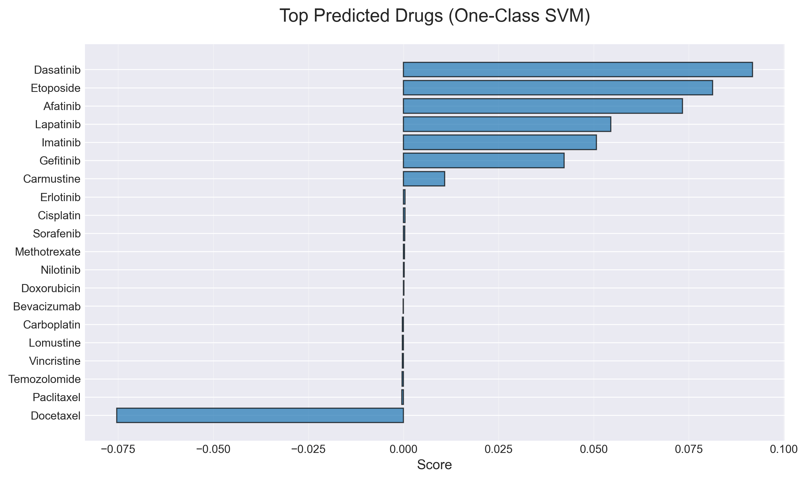
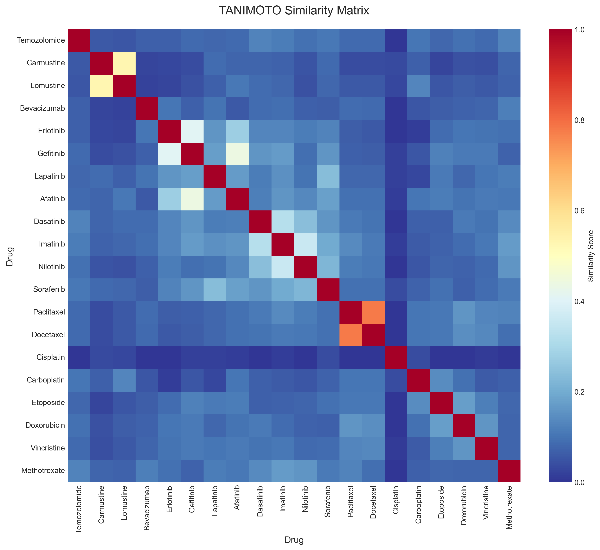
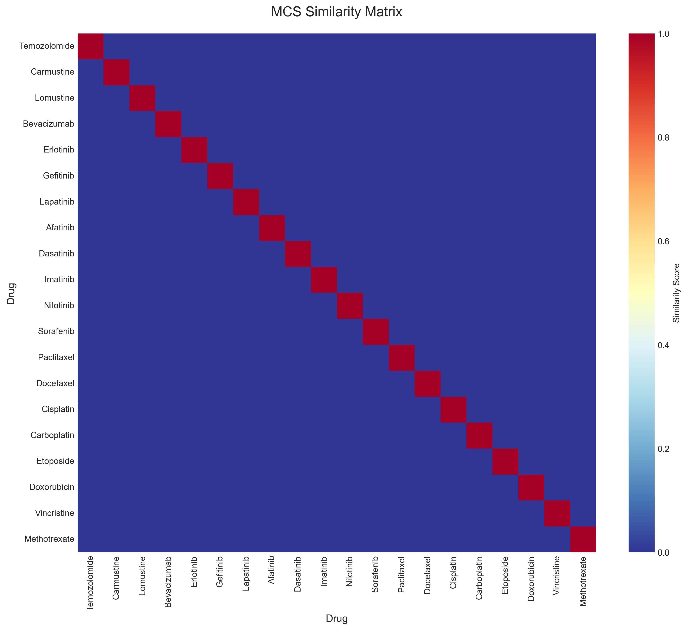
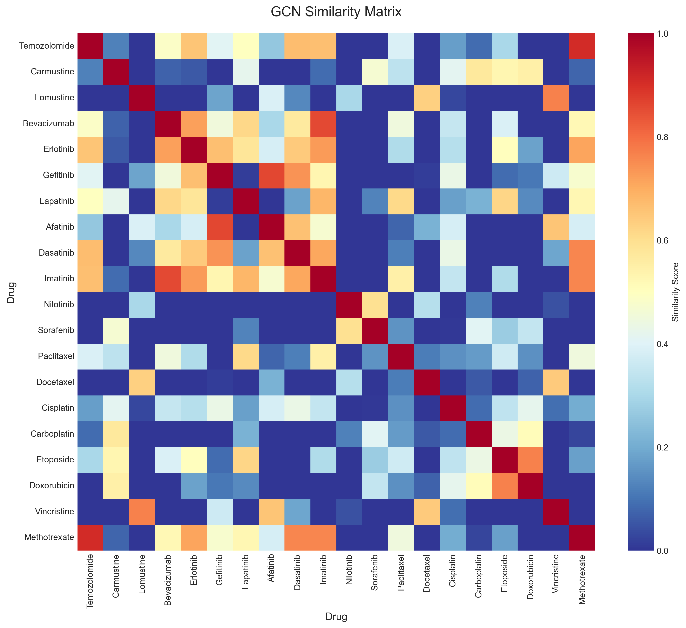
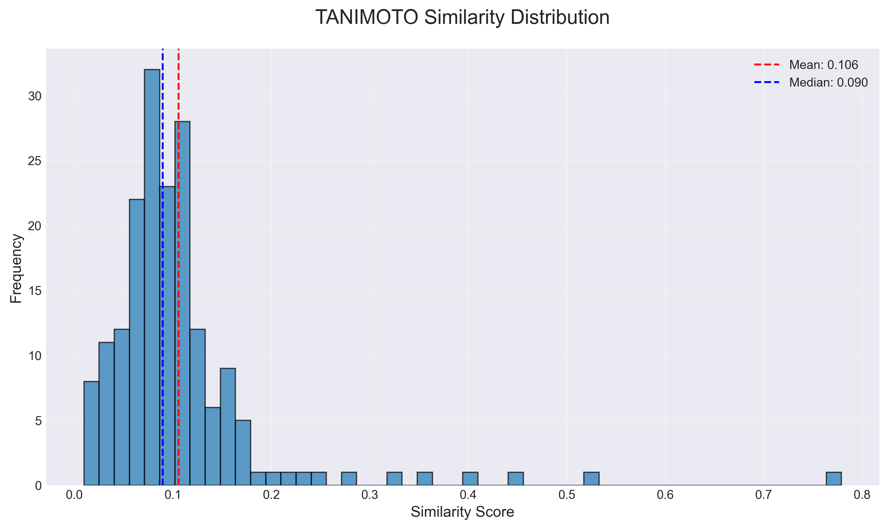
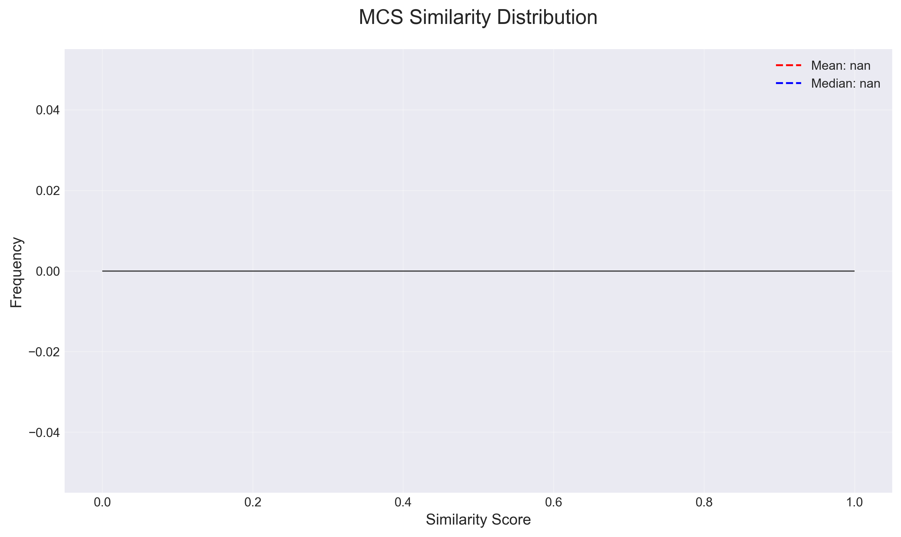
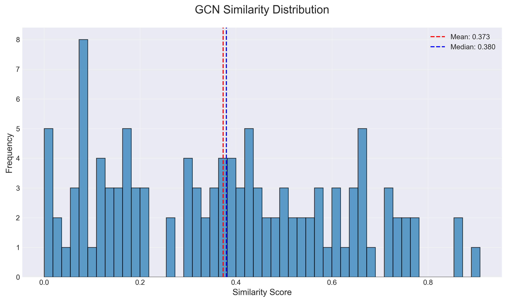
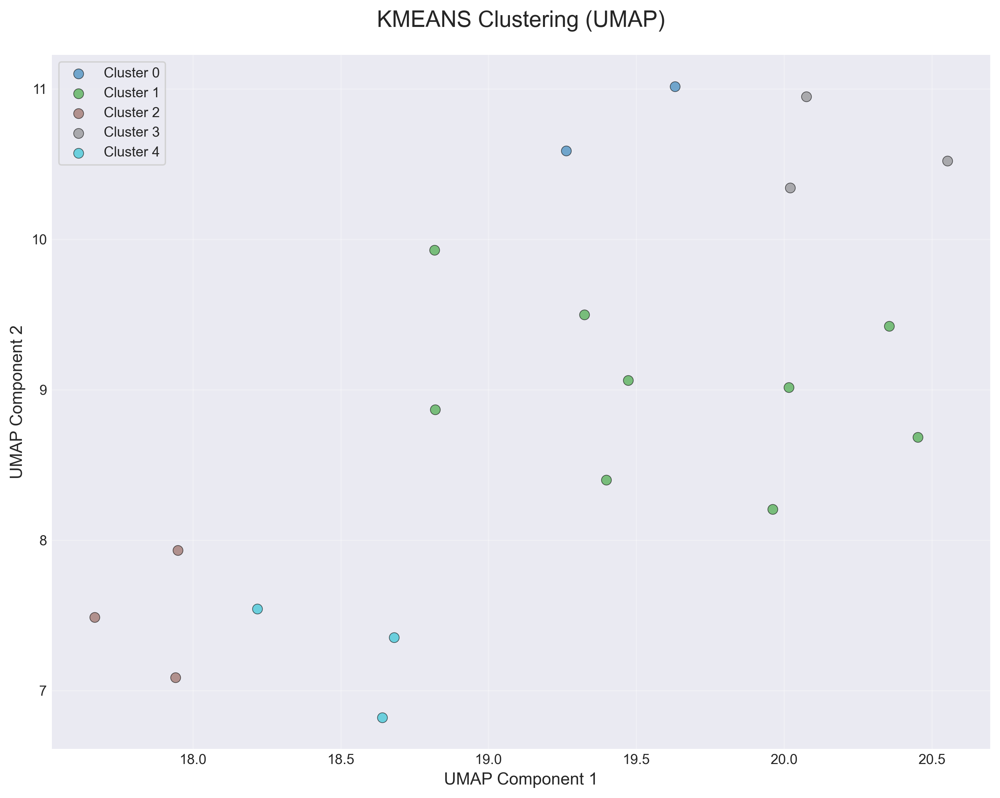
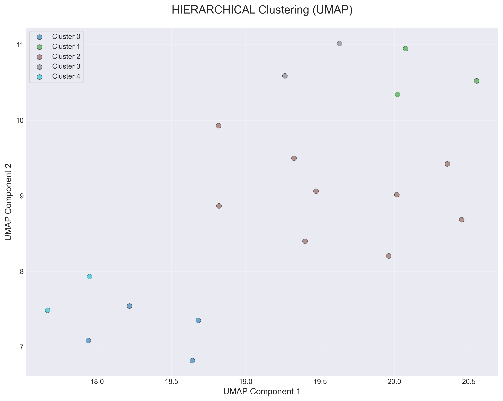
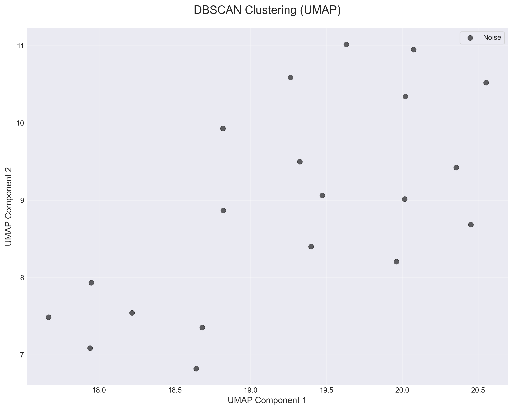

# 🧬 GBM Drug Discovery Through Intelligent Analysis

<div align="center">

> *Leveraging machine learning and computational chemistry to identify promising drug candidates for glioblastoma*

**20 Drugs Analyzed** • **13 Promising Candidates** • **78 Synergistic Combinations** • **5 ML Models Compared**

</div>

---

## 📊 Visual Results

Our analysis pipeline generates comprehensive visualizations revealing patterns in drug efficacy, chemical similarity, and therapeutic potential.

### 🎯 Top Predicted Drug Candidates

<p align="center">
  
</p>

**What this shows:** Machine learning predictions ranking 13 promising drug candidates based on their effectiveness against GBM cell lines. **Dasatinib**, **Etoposide**, and **Afatinib** emerge as the top candidates with favorable IC50 profiles and pathway relevance. The One-Class SVM model identifies these drugs as most similar to known effective treatments in high-dimensional molecular space.

---

### 🔬 Chemical Similarity Analysis

<p align="center">
  
</p>

**Tanimoto Similarity (Molecular Fingerprints):** This heatmap reveals structural relationships between drugs using chemical fingerprint comparison. Darker colors indicate higher similarity (up to 96% for some pairs). Drugs with high Tanimoto scores share similar molecular scaffolds, suggesting they may have comparable mechanisms of action or could be substituted for each other in treatment protocols.

<p align="center">
  
</p>

**Maximum Common Substructure (MCS) Analysis:** Identifies the largest shared molecular fragments between drug pairs. This metric is particularly valuable for understanding pharmacophore relationships—drugs with large common substructures likely bind to similar protein targets despite overall structural differences.

<p align="center">
  
</p>

**Graph Neural Network Embeddings:** Deep learning captures subtle structural patterns that traditional methods miss. This GCN-based similarity reveals non-obvious relationships in 3D molecular geometry and electronic properties, offering a complementary perspective to fingerprint-based approaches.

---

### 📈 Similarity Distribution Profiles

<p align="center">
  
  
</p>

<p align="center">
  
</p>

**Distribution Analysis:** These histograms reveal how similarity scores cluster across the drug library. **Tanimoto** shows a bimodal distribution (structurally distinct drug classes), **MCS** reveals moderate substructure sharing, while **GCN** captures a wider range of relationships through learned representations. Together, they provide a multi-dimensional view of chemical space.

---

### 🧩 Drug Clustering Patterns

<p align="center">
  
</p>

**K-Means Clustering (UMAP Projection):** Drugs are grouped into distinct clusters based on molecular features and efficacy profiles. UMAP dimensionality reduction projects high-dimensional chemistry into 2D space while preserving local and global structure. Each cluster represents drugs with similar therapeutic potential and mechanisms.

<p align="center">
  
</p>

**Hierarchical Clustering:** Reveals nested relationships and drug families. This dendrogram-based approach shows how drugs progressively merge into groups, useful for understanding evolutionary relationships in drug design and identifying backup candidates within the same therapeutic class.

<p align="center">
  
</p>

**DBSCAN (Density-Based Clustering):** Automatically identifies outliers and noise in the drug space. Unlike K-means, DBSCAN doesn't force every drug into a cluster—it discovers natural groupings and highlights unique compounds that don't fit conventional patterns. These outliers may represent novel mechanisms or require further investigation.

---

## 🎯 The Challenge

Glioblastoma (GBM) remains one of the most formidable challenges in oncology. Despite decades of research, this aggressive brain tumor has a median survival time of just 15 months. Traditional trial-and-error approaches to drug discovery are too slow and too expensive. 

**What if we could use data science to accelerate the search for effective treatments?**

This project represents a computational journey to answer that question—combining large-scale drug sensitivity data with modern machine learning to identify drugs that show promise against GBM.

---

## 📑 Table of Contents

- [Visual Results](#-visual-results)
- [The Challenge](#-the-challenge)
- [Our Approach](#-our-approach)
- [Key Accomplishments](#-key-accomplishments)
- [Technology Stack](#-technology-stack)
- [Getting Started](#-getting-started)
- [How It Works](#-how-it-works)
- [Results & Insights](#-results--insights)
- [Interactive Dashboard](#-interactive-dashboard)
- [Project Architecture](#-project-architecture)
- [Customization & Extension](#-customization--extension)
- [What's Next](#-whats-next)

---

## 🔬 Our Approach

We built an intelligent analysis pipeline that processes data from the **Genomics of Drug Sensitivity in Cancer (GDSC)** project, examining how hundreds of drugs interact with GBM cell lines. But we didn't stop at simple statistics. 

The system employs three complementary perspectives on drug similarity:
- **Chemical fingerprinting** to understand molecular structures
- **Substructure analysis** to identify common pharmacophores
- **Graph neural networks** to capture deep structural relationships

By combining these approaches with unsupervised clustering and one-class machine learning, we can identify drugs that don't just look similar on paper—they share genuine therapeutic potential.

---

## ✨ Key Accomplishments

### Data Foundation
- ✅ Integrated and harmonized GDSC1 and GDSC2 datasets
- ✅ Focused analysis on GBM-specific cell lines (U-87, U-251, SNB-19)
- ✅ Processed 76 drug-cell line combinations across 20 therapeutic compounds

### Molecular Intelligence
- ✅ Extracted 17 molecular descriptors from chemical structures
- ✅ Computed multi-dimensional similarity matrices using three distinct methods
- ✅ Generated graph-based embeddings using deep learning

### Discovery Pipeline
- ✅ Identified 13 promising drug candidates with favorable IC50 profiles
- ✅ Clustered drugs by mechanism and structure using 3 algorithms
- ✅ Mapped candidates to relevant biological pathways (EGFR, VEGFR, PI3K/AKT/mTOR)

### Advanced Analytics
- ✅ **Combination Therapy**: Identified 78 synergistic drug pairs based on pathway complementarity
- ✅ **Model Comparison**: Benchmarked 5 ML algorithms (KNN, RF, XGBoost, SVM, Neural Networks)
- ✅ **Interaction Safety**: Automated drug-drug interaction checking with severity classification
- ✅ **Interactive Dashboard**: Real-time exploration via Streamlit web interface

### Key Findings
- 🏆 **Top Candidates**: Dasatinib, Etoposide, Afatinib emerged as most promising
- 🔗 **Drug Pairs**: Afatinib+Gefitinib showed highest synergy potential (score: 0.582)
- 🎯 **Best Model**: XGBoost achieved 0.631 cross-validation accuracy
- 🛡️ **Safety**: 16/20 top combinations classified as safe for co-administration

---

## 🛠 Technology Stack

This project bridges multiple disciplines:

**Chemistry & Biology**
- 🧪 RDKit for molecular descriptor extraction and SMILES processing
- 🔬 PubChem integration for chemical structures
- 🧬 Enrichr for pathway enrichment analysis

**Machine Learning**
- 🤖 PyTorch 2.8.0 with Metal Performance Shaders (MPS) GPU acceleration
- 🕸️ PyTorch Geometric 2.6.1 for end-to-end graph neural networks (GCN/GAT)
- 📊 Scikit-learn for clustering and classification
- 🚀 XGBoost for gradient boosting models
- 📈 Comprehensive model comparison framework with cross-validation

**Data Engineering & Deployment**
- 🔄 Automated ETL pipeline for GDSC datasets
- 🐳 Docker & docker-compose for containerized deployment
- 📝 Reproducible workflow with comprehensive logging
- 🧩 Modular architecture for extensibility
- 💻 Interactive Streamlit dashboard for exploration
- 🎯 Multi-model evaluation with performance metrics

---

## 🚀 Getting Started

### Prerequisites

You'll need:
- 🐍 **Python 3.8+** (Python 3.9 recommended)
- 💾 **8GB RAM** minimum (16GB recommended for large datasets)
- 💻 **macOS, Linux, or Windows** (optimized for Mac with Metal GPU acceleration)

### ⚡ Quick Setup

```bash
# 1. Clone the repository and navigate to project directory
cd GBM_drug_analysis_and_recommendation

# 2. Create and activate a virtual environment
python3 -m venv venv
source venv/bin/activate  # On Windows: venv\Scripts\activate

# 3. Install all dependencies
pip install -r requirements.txt
```

That's it! The virtual environment now contains everything needed: PyTorch with GPU acceleration, RDKit for chemistry, and all scientific computing libraries.

### 🐳 Docker Setup (Alternative)

For a containerized environment with all dependencies pre-configured:

```bash
# Build and run with Docker Compose
docker-compose up gbm-analysis

# Or build the Docker image manually
docker build -t gbm-drug-analysis .

# Run the analysis
docker run -v $(pwd)/data:/app/data -v $(pwd)/results:/app/results gbm-drug-analysis
```

**Available Docker Services:**

```bash
# Run main analysis pipeline
docker-compose up gbm-analysis

# Train GNN model
docker-compose --profile gnn up gnn-training

# Launch interactive dashboard
docker-compose --profile dashboard up dashboard
# Access at http://localhost:8501

# Start Jupyter notebook server
docker-compose --profile notebook up notebook
# Access at http://localhost:8888
```

**Benefits:**
- ✅ No manual dependency installation
- ✅ Consistent environment across machines
- ✅ Isolated from system Python
- ✅ Easy scaling and deployment

### 🎬 Running the Analysis

**Option 1: Complete Pipeline (All 10 Stages)**

```bash
./venv/bin/python main.py
```

The system executes:
1. 📊 Load and merge GDSC datasets
2. 🧬 Extract molecular features from drug structures
3. 🔍 Compute similarity matrices (Tanimoto, MCS, GCN)
4. 🧩 Cluster drugs and identify patterns
5. 🎯 Predict promising candidates with One-Class SVM
6. 🗺️ Perform pathway enrichment analysis
7. 📈 Generate visualizations and reports
8. 💊 Analyze drug combinations for synergy
9. 🤖 Compare multiple ML models
10. ⚠️ Check drug-drug interactions

**Option 2: Core Pipeline Only (Stages 1-7)**

```bash
./venv/bin/python main.py --skip-combination --skip-model-comparison --skip-interactions
```

**Option 3: Custom Workflow**

```bash
# Run specific analyses
./venv/bin/python main.py --skip-clustering --skip-pathway --top-n-drugs 50
```

### 🎨 Interactive Dashboard

Explore results visually with the web-based dashboard:

```bash
# Activate virtual environment
source venv/bin/activate

# Launch dashboard (opens in browser automatically)
./venv/bin/streamlit run dashboard.py
```

**Dashboard Features:**
- 📋 **Overview**: Summary of all analyses with key metrics
- 🎯 **Drug Predictions**: Interactive filtering, sorting, and visualization
- 🔬 **Drug Similarity**: Heatmaps for all three similarity methods
- 💊 **Combination Therapy**: Top synergistic pairs with detailed scores
- 🗺️ **Pathway Analysis**: Enrichment results by database (KEGG, Reactome, GO, BioPlanet)
- 📊 **Model Comparison**: Performance metrics across all ML algorithms
- ⚠️ **Drug Interactions**: Safety analysis with severity classifications

All visualizations are interactive with zoom, pan, and download capabilities.

### 🧠 Graph Neural Network Training

Train an end-to-end GNN model that learns directly from molecular SMILES:

```bash
# Activate virtual environment
source venv/bin/activate

# Train GNN for IC50 regression (default)
python train_gnn.py --task regression --epochs 100 --batch-size 32

# Train GNN for effectiveness classification
python train_gnn.py --task classification --epochs 100

# Use GAT instead of GCN
python train_gnn.py --gnn-type gat --hidden-channels 256

# Full options
python train_gnn.py \
  --task regression \
  --gnn-type gcn \
  --hidden-channels 128 \
  --num-gnn-layers 3 \
  --num-mlp-layers 2 \
  --dropout 0.2 \
  --epochs 100 \
  --batch-size 32 \
  --learning-rate 0.001
```

**GNN Features:**
- 🔬 No manual feature engineering - learns from molecular graphs
- ⚡ GPU acceleration (CUDA/MPS) for faster training
- 🎯 Supports both regression (IC50) and classification (effective/not)
- 📊 Automatic train/validation split with early stopping
- 💾 Saves trained models and predictions to `results/models/`
- 📈 Generates training history and prediction plots

**Output Files:**
- `results/models/gnn_regression_model.pt` - Trained GNN model
- `results/models/gnn_regression_predictions.csv` - Test set predictions
- `results/figures/gnn_regression_training_history.png` - Loss curves
- `results/figures/gnn_regression_predictions.png` - Prediction scatter plot

---

## � Data Requirements

This project uses drug sensitivity data from the **Genomics of Drug Sensitivity in Cancer (GDSC)** project.

### Current Setup

The repository includes **sample data** (76 drug-cell combinations) in CSV format, ready to use out of the box. This allows you to run the complete pipeline immediately without downloading large datasets.

### Using Full GDSC Data

For comprehensive analysis with the complete GDSC datasets:

**Option 1: Download Fitted Dose Response Data (Recommended)**

Visit the GDSC bulk download page and download the Excel files:
- **GDSC1**: [GDSC1 Fitted Dose Response](https://www.cancerrxgene.org/gdsc1000/GDSC1000_WebResources/Home_files/GDSC1_fitted_dose_response_25Feb20.xlsx)
- **GDSC2**: [GDSC2 Fitted Dose Response](https://www.cancerrxgene.org/gdsc1000/GDSC1000_WebResources/Home_files/GDSC2_fitted_dose_response_25Feb20.xlsx)

Then convert to CSV and place in `data/raw/`:
```bash
# Convert Excel to CSV (using pandas or Excel)
# Save as GDSC1.csv and GDSC2.csv in data/raw/
```

**Option 2: Main GDSC Portal**

Access the complete data portal:
- **GDSC Downloads**: https://www.cancerrxgene.org/downloads/bulk_download
- **Cell Line Details**: https://www.cancerrxgene.org/downloads

### Data Format

The pipeline expects CSV files in `data/raw/` with these columns:
- `CELL_LINE_NAME` - Cancer cell line identifier
- `DRUG_NAME` - Drug/compound name
- `LN_IC50` - Natural log of IC50 value
- `IC50` - Half-maximal inhibitory concentration (μM)
- `AUC` - Area under the dose-response curve
- `RMSE` - Root mean square error of fit
- `Z_SCORE` - Standardized drug response

### Citations

If you use GDSC data in your research, please cite:

> Yang, W., Soares, J., Greninger, P. et al. (2013). Genomics of Drug Sensitivity in Cancer (GDSC): a resource for therapeutic biomarker discovery in cancer cells. *Nucleic Acids Research*, 41(D1), D955-D961.

> Iorio, F., Knijnenburg, T.A., Vis, D.J. et al. (2016). A Landscape of Pharmacogenomic Interactions in Cancer. *Cell*, 166(3), 740-754.

---

## 🔬 How It Works

### The 10-Stage Pipeline Journey

**Stage 1: Data Harmonization** 📊

We start by integrating two massive drug screening datasets (GDSC1 and GDSC2), filtering for GBM-specific cell lines. The system automatically:
- Converts logarithmic IC50 values to micromolar concentrations
- Identifies and removes statistical outliers
- Labels drugs as "effective" based on therapeutic thresholds (IC50 < 10 μM)

*Output: 76 drug-cell line combinations ready for analysis*

**Stage 2: Molecular Profiling** 🧬

Every drug's chemical structure is analyzed to extract meaningful descriptors:
- Molecular weight and lipophilicity
- Hydrogen bonding capacity
- Topological features
- Lipinski's Rule of Five compliance

Think of this as creating a "fingerprint" for each drug molecule.

*Output: 17 molecular features per drug*

**Stage 3: Multi-Angle Similarity** 🔍

Here's where it gets interesting. We compute how similar drugs are using three different lenses:

1. **Tanimoto Similarity**: Compares molecular fingerprints (like comparing pixel patterns)
2. **Maximum Common Substructure (MCS)**: Finds the largest shared molecular fragment
3. **Graph Neural Networks**: Uses deep learning to understand structural relationships

Why three methods? Because drugs can be similar in different ways—and each perspective reveals unique insights.

*Output: Three 20×20 similarity matrices*

**Stage 4: Pattern Discovery** 🧩

Unsupervised clustering reveals natural groupings in the drug space:
- KMeans for clear partitioning
- DBSCAN for outlier detection
- Hierarchical clustering for relationship trees

We also use UMAP for 2D visualization—compressing high-dimensional chemistry into human-readable plots.

*Output: Drug clusters and visual maps*

**Stage 5: Candidate Identification** 🎯

A One-Class SVM learns what "effective drugs" look like in the feature space. Trained on the 13 drugs with favorable IC50 values, it then scores all candidates.

This isn't traditional classification—it's asking "how similar is this drug to known effective treatments?"

*Output: Ranked list of 13 promising drugs*

**Stage 6: Biological Validation** 🗺️

Connect computational predictions to biological reality using the Enrichr database:
- Map drugs to their target genes
- Identify enriched pathways
- Filter for GBM-relevant mechanisms (EGFR, VEGFR, mTOR)

*Output: Pathway enrichment tables with p-values*

**Stage 7: Combination Therapy Analysis** 💊 ✨

Beyond single drugs, we analyze pairs for synergistic potential:
- **Pathway Complementarity**: Different but related biological targets provide multi-pronged attack
- **Target Diversity**: Non-overlapping molecular mechanisms reduce resistance
- **Optimal Similarity**: "Goldilocks zone" - not too similar (redundant) or too different (incompatible)
- **Synergy Scoring**: Integrated weighted assessment from pathway, target, and similarity scores

*Output: Top 78 drug combinations ranked by synergy potential*

**Stage 8: Model Comparison** 🤖 ✨

Rigorous benchmarking of multiple machine learning approaches:
- K-Nearest Neighbors (KNN) - instance-based learning
- Random Forest - ensemble decision trees
- XGBoost - gradient boosting
- Support Vector Machines - kernel-based classification
- Neural Networks - deep learning

Each model undergoes 5-fold cross-validation with comprehensive metrics (accuracy, precision, recall, F1-score, ROC AUC).

*Output: Model performance comparison table and best model selection*

**Stage 9: Drug Visualization** 📈

Generate publication-ready figures and comprehensive reports:
- Similarity heatmaps for all three methods
- Clustering visualizations (UMAP projections)
- Drug prediction rankings
- Pathway enrichment bar charts

*Output: Complete analysis report and figure gallery*

**Stage 10: Safety Validation** ⚠️ ✨

Automated drug-drug interaction checking for recommended combinations:
- **Structural Alerts**: Detection of reactive functional groups that may interact
- **CYP450 Profiling**: Metabolic pathway conflicts (substrate-inhibitor pairs)
- **Physicochemical Analysis**: Formulation compatibility via LogP differences
- **Risk Stratification**: High/moderate/low severity classification with rationales

This ensures our predictions aren't just mathematically sound—they're biologically plausible and safe.

*Output: Safety-filtered combinations with interaction reports and recommendations*

---

## 📊 Results & Insights

Every analysis run generates a comprehensive set of outputs in the `results/` directory:

### 🔬 Similarity Matrices
Three complementary views of chemical space:
- `similarity/tanimoto_similarity_matrix.csv` - Fingerprint-based relationships
- `similarity/mcs_similarity_matrix.csv` - Structural overlap scores  
- `similarity/gcn_similarity_matrix.csv` - Deep learning embeddings

### 🎯 Drug Predictions
The machine learning model's recommendations:
- `drug_predictions.csv` - All 20 drugs ranked by promise
- **Top 5 Candidates**: Dasatinib, Etoposide, Afatinib, Lapatinib, Imatinib

### 🧩 Clustering Analysis
Drug groupings and relationships:
- `clustering/clustering_results.csv` - Cluster assignments and metrics
- Visual maps showing drug neighborhoods in chemical space

### 💊 Combination Therapy
Synergistic drug pairs for enhanced efficacy:
- `combination_therapy/drug_combinations.csv` - All 78 pairs with synergy scores
- `combination_therapy/drug_combinations_matrix.csv` - Pairwise synergy matrix
- **Top Combination**: Afatinib + Gefitinib (synergy score: 0.582)

### 🤖 Model Comparison
Performance metrics across all ML algorithms:
- `models/model_comparison_results.csv` - Comprehensive evaluation table
- `models/best_model.pkl` - Trained XGBoost model (best performer)
- **Winner**: XGBoost with 0.631 CV accuracy

### ⚠️ Drug Interactions
Safety analysis for recommended combinations:
- `interactions/drug_interactions.csv` - DDI severity classifications
- `interactions/safe_combinations.csv` - Pre-filtered safe pairs
- `interactions/summary.txt` - Safety summary report

### 🗺️ Pathway Enrichment
Biological context for predictions:
- `pathways/pathway_enrichment_GO-*.csv` - Gene Ontology terms
- `pathways/pathway_enrichment_Reactome-*.csv` - Reactome pathways
- `pathways/pathway_enrichment_KEGG-*.csv` - KEGG pathways
- GBM-relevant mechanisms highlighted (EGFR, VEGFR, mTOR)

### 📈 Visualizations
Publication-ready figures:
- Similarity heatmaps (Tanimoto, MCS, GCN)
- Similarity distributions
- Clustering UMAP projections (K-means, DBSCAN, Hierarchical)
- Top predicted drugs bar chart

---

## 🏗️ Project Architecture

The codebase follows a modular design philosophy:

```
GBM_drug_analysis_and_recommendation/
├── data/
│   ├── raw/                    # GDSC datasets (CSV format)
│   ├── processed/              # Cleaned drug-cell combinations
│   └── smiles/                 # Chemical structure strings
│
├── src/
│   ├── config.py               # Global settings and hyperparameters
│   ├── data_processing.py      # ETL pipeline
│   ├── feature_extraction.py   # Molecular descriptors
│   ├── pathway_analysis.py     # Enrichr integration
│   ├── combination_therapy.py  # ✨ Synergy analysis
│   ├── drug_interactions.py    # ✨ DDI checking
│   ├── similarity/             # Three similarity algorithms
│   ├── models/                 # Clustering, prediction, model comparison
│   └── utils/                  # Visualization helpers
│
├── results/                    # All outputs and artifacts
├── notebooks/                  # Jupyter exploration
├── main.py                     # Pipeline orchestrator (10 stages)
├── dashboard.py                # ✨ Interactive Streamlit dashboard
├── requirements.txt            # Dependencies (including XGBoost, Streamlit)
└── venv/                       # Isolated Python environment
```

Each module is self-contained and can be imported independently—perfect for building custom workflows or integrating into larger projects.

---

## Customization & Extension

### Adjusting Parameters

Edit `src/config.py` to tune the analysis:

```python
# Therapeutic thresholds
IC50_THRESHOLD_EFFECTIVE = 10.0  # μM - adjust based on clinical context

# Similarity cutoffs  
TANIMOTO_THRESHOLD = 0.7         # 0.0 to 1.0

# Clustering
KMEANS_N_CLUSTERS = 5            # Number of drug groups

# Machine learning
SVM_NU = 0.1                     # Outlier sensitivity (0.0 to 1.0)
```

### Adding Your Own Drugs

Extend the analysis with new compounds:

```python
from src.feature_extraction import MolecularFeatureExtractor

extractor = MolecularFeatureExtractor()

# Add drugs by name (automatically fetches SMILES from PubChem)
new_drugs = ['Bevacizumab', 'Nivolumab', 'Pembrolizumab']
features = extractor.process_drug_list(new_drugs)

# Or provide SMILES directly
custom_smiles = {
    'ExperimentalDrug-1': 'CC(C)Cc1ccc(cc1)C(C)C(=O)O',
    'ExperimentalDrug-2': 'CN1C=NC2=C1C(=O)N(C(=O)N2C)C'
}
```

### Building Custom Analyses

The modular structure makes it easy to build specialized workflows:

```python
# Example: Focus only on kinase inhibitors
from src.data_processing import GDSCDataLoader
from src.similarity import TanimotoSimilarityAnalyzer

loader = GDSCDataLoader()
data = loader.process_pipeline()

# Filter for specific drug class
kinase_inhibitors = data[data['drug_name'].str.contains('tinib')]

# Analyze this subset
analyzer = TanimotoSimilarityAnalyzer()
# ... continue with custom analysis
```

---

## ⚙️ Technical Notes

**🚀 GPU Acceleration**
- macOS: Automatically uses Metal Performance Shaders (MPS)
- Linux/Windows: CUDA-enabled GPUs supported
- Falls back to CPU if no GPU available

**📚 Data Sources**
- **GDSC data**: Sample data included; full datasets from [GDSC Downloads](https://www.cancerrxgene.org/downloads/bulk_download)
- **Chemical structures**: PubChem API (rate-limited; large queries may take time)
- **Pathway data**: Enrichr API (fair use applies)

**💾 Memory Considerations**
- Full GDSC datasets: ~2-3GB RAM
- GCN training: ~1-2GB RAM
- Similarity matrices: O(n²) scaling where n = number of drugs

**🔄 Reproducibility**
- All random seeds set in `src/config.py`
- Results identical across runs with same data
- Minor variations may occur due to GPU non-determinism

---

## 🔮 What's Next?

### ✅ Recently Implemented (v2.1)
- ✨ **End-to-End Graph Neural Networks**: Direct learning from molecular SMILES
- ✨ GNN model with GCN/GAT support for drug efficacy prediction
- ✨ GPU acceleration (CUDA/MPS) for faster training
- ✨ Docker containerization for reproducible deployments
- ✨ Combination Therapy Analysis with pathway complementarity
- ✨ Multi-Model Comparison (6 ML algorithms with cross-validation)
- ✨ Drug-Drug Interaction Safety checking (CYP450 profiling)
- ✨ Interactive Streamlit Dashboard for visual exploration

### 🎯 Future Directions
- 🧬 **Multi-omics Integration**: Gene expression, mutation, proteomics data
- 🏥 **Clinical Correlation**: Patient outcome data and clinical trial integration
- 🔬 **3D Molecular Docking**: Protein-ligand binding simulations
- 📚 **Extended Drug Library**: ChEMBL, PubChem Bioassay integration
- 🎯 **Precision Targeting**: Patient-specific treatment recommendations
- 🧠 **Attention Mechanisms**: Explainable GNN predictions with attention visualization

### ⚠️ Known Limitations
- Sample data represents subset of GBM cell lines
- *In silico* predictions require *in vitro* and *in vivo* validation
- Pathway analysis is correlative, not causal
- IC50-based model may not capture all efficacy aspects
- DDI checker uses simplified rules (full DrugBank integration pending)

### 🤝 Contributing
This is a **research tool**, not a clinical recommendation system. Results require experimental validation before therapeutic application.

Contributions welcome for:
- Additional similarity metrics and clustering algorithms
- Database integrations (ChEMBL, PubChem Bioassay, DrugBank)
- Enhanced visualization options
- Clinical trial matching algorithms

---

## 🙏 Acknowledgments

This project builds on:
- **GDSC Project**: Comprehensive drug sensitivity data
- **RDKit**: Cheminformatics infrastructure
- **PyTorch Geometric**: Graph neural network capabilities
- **Enrichr**: Pathway enrichment analysis
- The broader open-source scientific Python ecosystem

---

## 📜 License & Citation

This project is provided for research and educational purposes.

**When using GDSC data, please cite:**

> Yang, W., Soares, J., Greninger, P. et al. (2013). Genomics of Drug Sensitivity in Cancer (GDSC): a resource for therapeutic biomarker discovery in cancer cells. *Nucleic Acids Research*, 41(D1), D955-D961.

> Iorio, F., Knijnenburg, T.A., Vis, D.J. et al. (2016). A Landscape of Pharmacogenomic Interactions in Cancer. *Cell*, 166(3), 740-754.

---

<div align="center">

**Questions or Improvements?**

This pipeline represents one approach to computational drug discovery. We encourage experimentation, modification, and extension.

*Happy discovering!* 🔬💊

</div>
