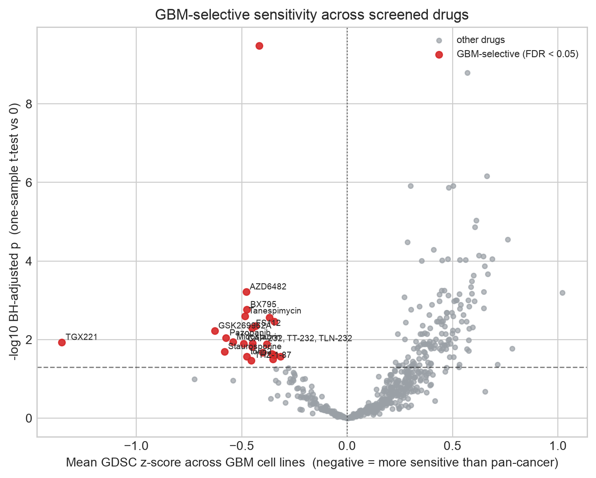
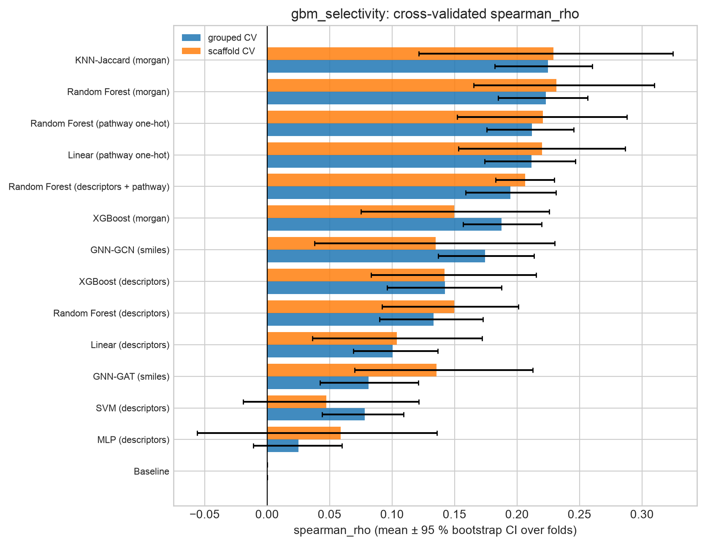
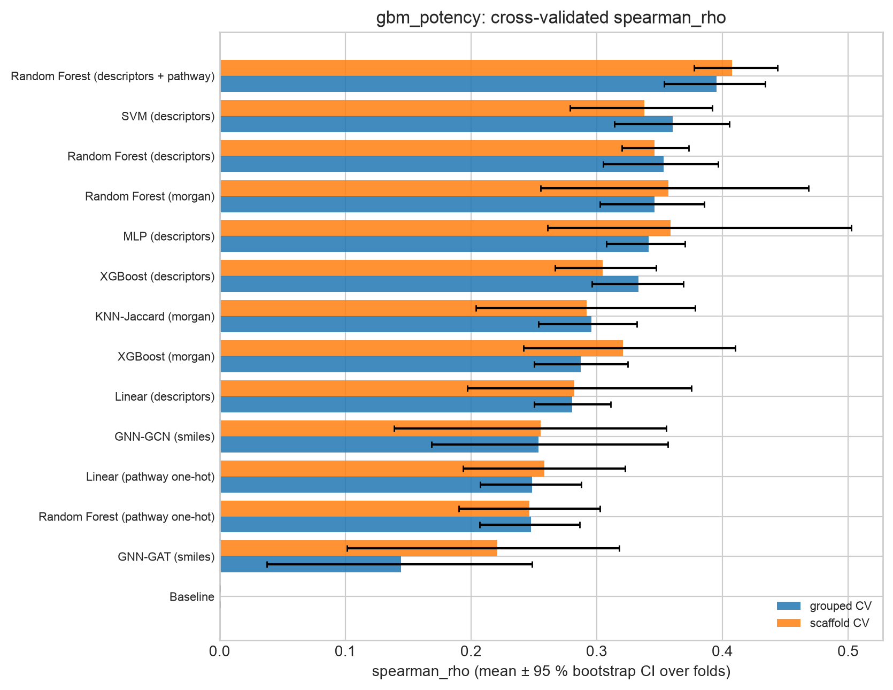
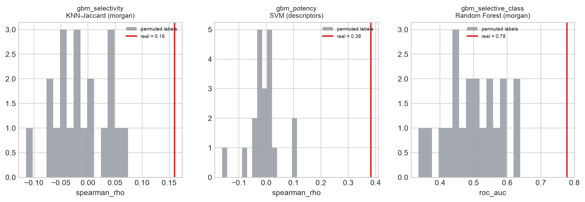
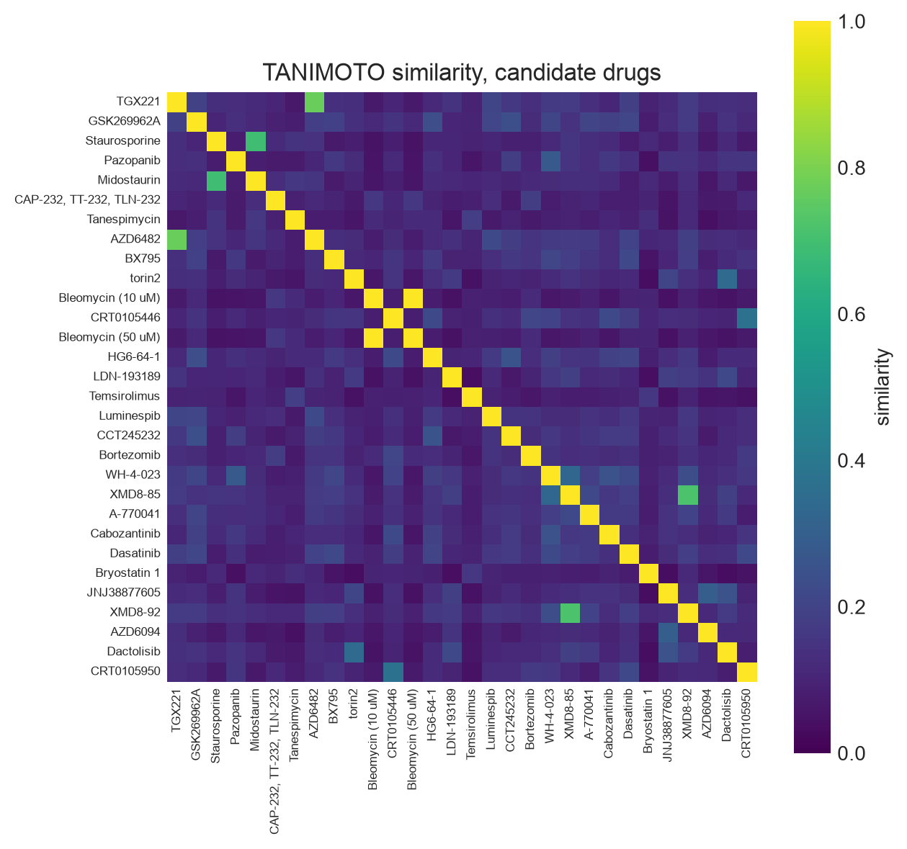
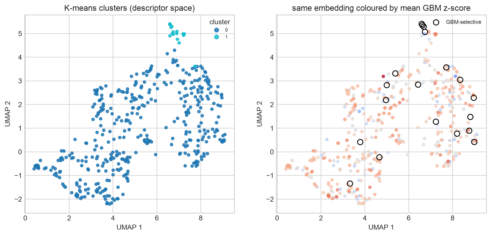

<h1 align="center">GBM Drug Recommender</h1>

<p align="center">
  <em>Structure, selectivity and combination hypotheses for glioblastoma,<br>
  from the GDSC drug-sensitivity screens — reproducibly, with null models.</em>
</p>

<p align="center">
  <a href="https://github.com/SatvikPraveen/gbm-drug-recommender/actions/workflows/ci.yml"></a>
  <a href="pyproject.toml"></a>
  <a href="LICENSE"></a>
  <a href="CITATION.cff"></a>
  <a href="data/MANIFEST.json"></a>
  <a href="https://satvikpraveen.github.io/gbm-drug-recommender/"></a>
</p>

---

## Abstract

Glioblastoma (GBM) remains one of the least treatable solid tumours, and most
drugs that reach it have been repurposed rather than designed. This project
takes the Genomics of Drug Sensitivity in Cancer (GDSC) screens — 20,329
dose–response curves for 542 compounds across 34 GBM cell lines — and asks
three questions with the rigour of a benchmark rather than a demo:

1. **Which compounds are *GBM-selective*,** i.e. more effective against GBM
   lines than against the pan-cancer panel, and with what confidence?
2. **Does chemical structure predict GBM response?** Descriptors, fingerprints
   and graph neural networks are evaluated on identical molecule-grouped and
   scaffold-disjoint folds, against dummy baselines, permutation nulls, and
   GDSC's own target-pathway annotation.
3. **Which pairs deserve a combination screen?** A transparent, documented
   heuristic — offered as hypotheses, never as synergy predictions.

Every table and figure is regenerated from the raw GDSC release by two
commands. No number in this repository was typed by hand.

> **Version 3.0 is a ground-up rewrite.** Earlier versions used a 20-drug
> sample and a random split that leaked drug identity between training and
> test; their reported metrics are withdrawn. See [`CHANGELOG.md`](CHANGELOG.md).

---

## Contents

- [Key findings](#key-findings)
- [Data](#data)
- [Benchmark](#benchmark)
- [Gallery](#gallery)
- [Getting started](#getting-started)
- [Pipeline](#pipeline)
- [Repository layout](#repository-layout)
- [Limitations](#limitations)
- [Citing](#citing)

---

## Key findings

<table>
<tr>
<td width="50%" valign="top">

**GBM selectivity is a property of target biology, not of chemotype.**
The two most GBM-selective compounds are PI3Kβ inhibitors (TGX-221,
AZD6482), consistent with the PI3Kβ dependence of PTEN-deficient GBM; ROCK,
HSP90, mTOR, TBK1/PDK1 and SRC-family inhibitors follow. Structure predicts
selectivity only weakly (Spearman ρ ≈ 0.22), and a 25-column one-hot of
GDSC's pathway annotation — containing no chemistry — does exactly as well.

</td>
<td width="50%" valign="top">

**Structure predicts general potency modestly, and graph neural networks
add nothing at this scale.** Descriptors and fingerprints reach ρ ≈ 0.40 for
mean ln IC50 on scaffold-disjoint folds. GCN and GAT encoders sit
mid-table on every task with ~430 molecules, as expected; they are reported
as a controlled comparison. Every headline number is backed by a
permutation null and a bootstrap interval.

</td>
</tr>
</table>

---

## Data

| | |
|---|---|
| **Source** | GDSC release 8.5 (27 Oct 2023): GDSC1 + GDSC2 fitted dose–response, compound and cell-line annotation. URLs and SHA-256 checksums pinned in [`data/MANIFEST.json`](data/MANIFEST.json). |
| **Cohort** | 34 cell lines with `TCGA_DESC == "GBM"` (GDSC's own label; a hand-written name list in earlier versions matched 4). |
| **Curves** | 20,329 drug × cell-line curves; duplicate screens averaged per cell line before any statistic. |
| **Compounds** | 542 distinct names; 429 with a validated, audited small-molecule structure from PubChem; 113 GDSC-internal codes and biologics without one. |
| **Endpoint** | `z_mean`, the mean GDSC z-score over GBM lines. Negative means GBM is more sensitive than the pan-cancer average. |
| **GBM-selective** | 24 compounds at FDR < 0.05 with mean z ≤ −0.3 (one-sample *t*-test per drug, Benjamini–Hochberg). |

The committed tables (`data/processed/`, `data/smiles/`) are sufficient to
run everything; [`data/README.md`](data/README.md) documents every column,
the curation of structures, and the caveats — notably that most fitted IC50s
lie beyond the tested concentration range, which is why the z-score, not a
raw IC50 threshold, is the primary endpoint.

---

## Benchmark

Three tasks, fourteen models, identical folds. Values are the mean over
folds with a 95 % bootstrap interval; the full tables, every model and every
metric are in the generated [`results/RESULTS.md`](results/RESULTS.md).

| Task | Best model (grouped CV) | Grouped CV | Scaffold CV | Baseline | Permutation *p* |
|---|---|---|---|---|---|
| GBM selectivity — `z_mean`, regression | KNN-Jaccard (Morgan) | ρ = 0.23 [0.18, 0.26] | ρ = 0.23 · Random Forest (Morgan) | 0.00 | 0.048 |
| GBM potency — `ln_ic50_mean`, regression | Random Forest (descriptors + pathway) | ρ = 0.40 [0.36, 0.44] | ρ = 0.41 · same model | 0.00 | 0.048 |
| GBM-selective — classification, 19 / 429 positive | Random Forest (Morgan) | AUC = 0.75 [0.69, 0.79] | AUC = 0.74 · same model | 0.50 | 0.048 |

*Grouped CV*: 5 × 5-fold, folds built over InChIKey connectivity blocks so
salts, stereoisomers and re-screens of one molecule never straddle a split.
Tabular hyper-parameters are selected by a nested 3-fold grouped CV inside each
training fold; GNN settings are fixed.
*Scaffold CV*: Bemis–Murcko scaffolds assigned whole to folds — the
out-of-distribution estimate. A permutation *p* of 0.048 means the real score
exceeded all 20 label-permuted runs, the floor for that many rounds. Protocol
and rationale: [`docs/METHODS.md`](docs/METHODS.md); interpretation:
[`docs/RESULTS.md`](docs/RESULTS.md).

---

## Gallery

<table>
<tr>
<td align="center" width="50%">
<br>
<sub><b>GBM-selective sensitivity.</b> Mean GDSC z-score over GBM lines against BH-adjusted <i>p</i>; the 24 selective compounds in red.</sub>
</td>
<td align="center" width="50%">
<br>
<sub><b>Predicting selectivity from structure and annotation.</b> Spearman ρ, mean ± 95 % CI over folds, grouped and scaffold CV.</sub>
</td>
</tr>
<tr>
<td align="center" width="50%">
<br>
<sub><b>Predicting potency.</b> Structure carries more signal for cytotoxic potency than for GBM selectivity.</sub>
</td>
<td align="center" width="50%">
<br>
<sub><b>Permutation null.</b> Score distribution under label permutation with the real score marked, per task.</sub>
</td>
</tr>
<tr>
<td align="center" width="50%">
<br>
<sub><b>Candidate compounds are structurally diverse.</b> Morgan/Tanimoto similarity among GBM-selective and top-ranked drugs.</sub>
</td>
<td align="center" width="50%">
<br>
<sub><b>Descriptor space.</b> Silhouette-chosen K-means clusters (left) and the same embedding coloured by GBM selectivity (right).</sub>
</td>
</tr>
</table>

---

## Getting started

```bash
git clone https://github.com/SatvikPraveen/gbm-drug-recommender.git
cd gbm-drug-recommender
./setup.sh && source .venv/bin/activate      # or: pip install -e ".[dev,dashboard]"

pytest                                      # 88 tests, ~15 s
python main.py --quick                      # every stage, no GNN, 1 CV repeat   (~2 min)
python main.py                              # full run: GNN, 5 × 5 CV, 20 null rounds   (~25 min)
streamlit run dashboard.py                  # browse results/
```

A laptop is sufficient. The 542 compounds aggregate to one row per molecule,
so the tabular models take seconds and the GNN minutes; Apple MPS and CUDA
are used when present but are not required.

To rebuild the committed data tables from the raw release and PubChem:

```bash
python scripts/download_gdsc.py      # ~50 MB; verifies SHA-256 against data/MANIFEST.json
python scripts/build_gbm_dataset.py  # → data/processed/
python scripts/fetch_smiles.py       # → data/smiles/ (PubChem, rate-limited, ~5 min)
```

Docker profiles: `docker compose run pipeline` · `quick` · `gnn` · `dashboard` · `test`.

---

## Pipeline

`python main.py` runs eleven stages; `--stages` selects a subset and adds
its dependencies. Every stage writes under `results/`, and
`results/metadata.json` records the commit, environment, configuration and
timings of the run that produced them.

| Stage | Purpose | Output |
|---|---|---|
| `data` | Load the committed GBM tables | — |
| `features` | RDKit descriptors, Morgan fingerprints, scaffolds, GDSC pathway one-hot; molecule groups for CV | `data/processed/molecular_features.csv` |
| `benchmark` | 11 tabular models + GCN/GAT on 3 tasks × 2 split strategies; baselines, bootstrap CIs, y-scrambling, out-of-fold predictions | `results/benchmark/` |
| `final_models` | Best model per task refit on all compounds; final GNN; per-drug score table | `results/models/` |
| `novelty` | One-Class SVM on GBM-selective compounds, scored out-of-fold (exploratory) | `results/models/novelty_*` |
| `clustering` | K-means (silhouette-chosen *k*), Ward, DBSCAN; PCA and UMAP | `results/clustering/` |
| `similarity` | Tanimoto for all compounds; MCS (rdFMCS) and GNN-embedding cosine for candidates; Mantel tests | `results/similarity/` |
| `combinations` | Pair scores from GDSC targets and pathways, potency and structural novelty; structural-alert screen | `results/combination_therapy/`, `results/interactions/` |
| `pathways` | Hypergeometric enrichment of selective-drug targets against the screened library (KEGG, Reactome, WikiPathways) | `results/pathways/` |
| `figures` | All figures | `results/figures/` |
| `report` | `RESULTS.md` generated from the artifacts; `metadata.json` | `results/` |

---

## Repository layout

```
gbm_drug/                 the package
├── config.py             every threshold and path; rationale in docs/METHODS.md
├── data_processing.py    GDSC → GBM subset → per-drug statistics
├── feature_extraction.py descriptors, fingerprints, scaffolds
├── evaluation.py         grouped / scaffold CV, metrics, bootstrap CIs, y-scrambling
├── models/               zoo.py (registry) · gnn_model.py · one_class_svm.py · clustering.py
├── similarity/           tanimoto · mcs_similarity · gnn_similarity · compare (Mantel)
├── combination_therapy.py, pathway_analysis.py, drug_interactions.py
└── pipeline.py, reporting.py, utils/
scripts/                  download_gdsc.py · build_gbm_dataset.py · fetch_smiles.py
data/                     MANIFEST.json · processed tables · SMILES with curation notes
results/                  output of the last full run: RESULTS.md, metadata.json, tables, figures
docs/                     METHODS.md (decisions) · RESULTS.md (interpretation)
tests/                    88 tests; CI runs them and a pipeline smoke run on Python 3.11 / 3.12
main.py · train_gnn.py · dashboard.py
```

---

## Limitations

- **Cell lines are not patients.** Sensitivity of 34 immortalised lines in
  two-dimensional culture says nothing about blood–brain-barrier penetration,
  toxicity or clinical benefit.
- **Small data.** 429 structures and 19 selective ones; scaffold-split
  estimates are the honest figure for new chemotypes, and they are modest.
- **Extrapolated IC50s.** For the median compound only 17 % of GBM curves
  have a fitted IC50 inside the tested range. Potency results inherit that.
- **Two assays.** GDSC1 and GDSC2 used different viability readouts; ln IC50
  is not batch-corrected (z-scores are computed within each screen).
- **Free-text annotation.** GDSC targets are mapped to gene symbols through
  an explicit alias table; unmapped tokens are reported, not guessed.
- **Combination scores are hypotheses.** No combination screen was used;
  nothing is validated against Bliss or Loewe measurements.
- **The interaction screen is structural.** Pharmacokinetic interactions are
  not modelled.

This is a research tool, not a clinical decision aid.

---

## Citing

Please cite this repository via [`CITATION.cff`](CITATION.cff), and the
resources it depends on:

- Yang W. *et al.* Genomics of Drug Sensitivity in Cancer (GDSC): a resource
  for therapeutic biomarker discovery in cancer cells. *Nucleic Acids Res.*
  41, D955–D961 (2013).
- Iorio F. *et al.* A landscape of pharmacogenomic interactions in cancer.
  *Cell* 166, 740–754 (2016).
- Kim S. *et al.* PubChem 2023 update. *Nucleic Acids Res.* 51, D1373–D1380 (2023).

GDSC data are provided for academic, non-commercial use; the derived tables
here carry the same terms. Code is released under the [MIT License](LICENSE).

<p align="center"><sub>Maintained by Satvik Praveen · Contributions welcome — see <a href="CONTRIBUTING.md">CONTRIBUTING.md</a></sub></p>
